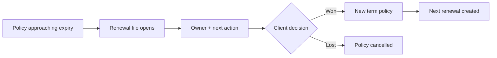
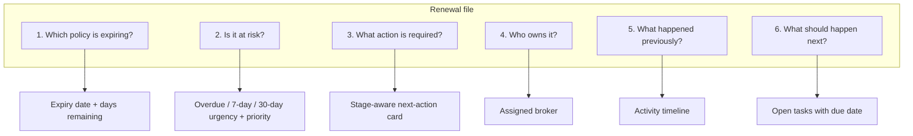
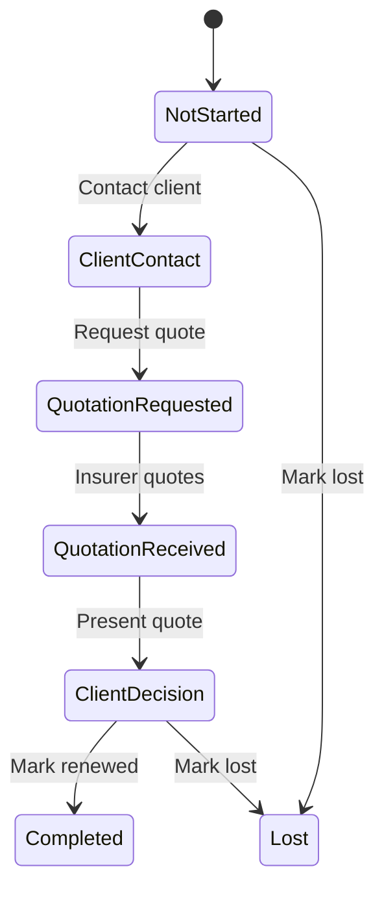
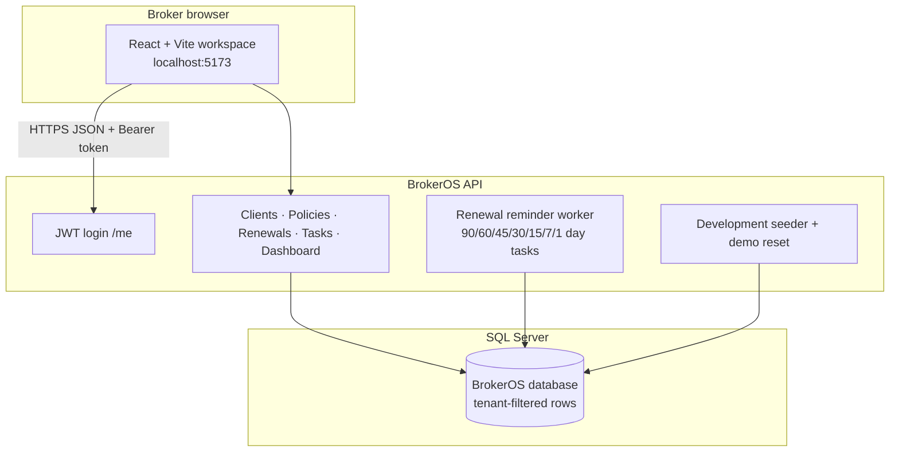
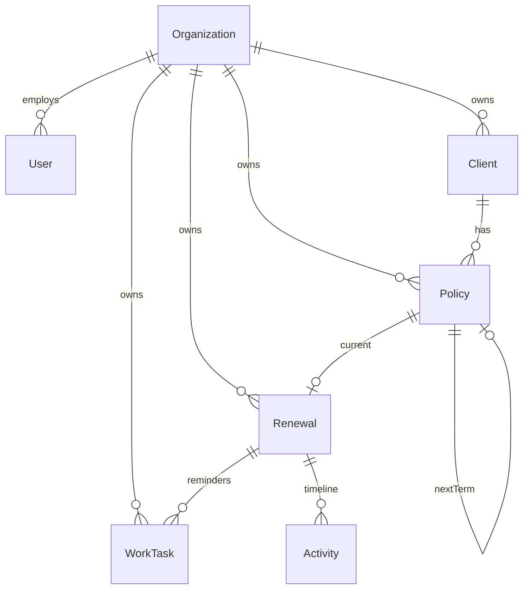
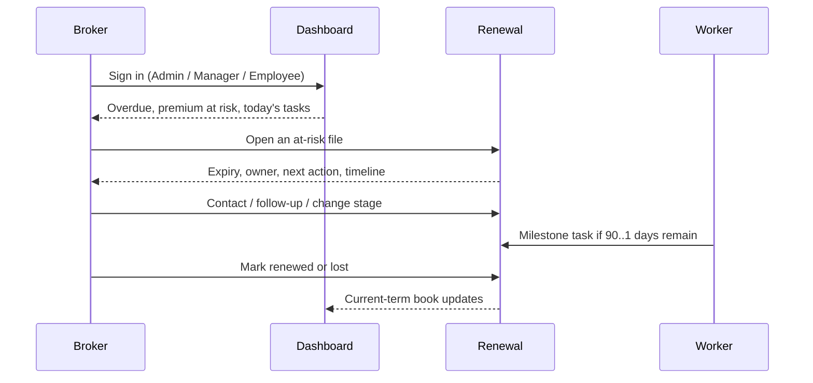

# BrokerOS — Product Overview

BrokerOS is a **renewal operations platform for Indian insurance brokers**.

The product exists to solve one desk problem: **never miss a policy expiry**. A broker should open the workspace and immediately see which policies are expiring, which renewals are at risk, who owns the work, what happened last, and what to do next.

This document describes what the platform does today, how it works, and where it can grow.

---

## 1. What the platform does

BrokerOS is a multi-tenant B2B workspace. One brokerage (organisation) owns a book of **clients**, **policies**, **renewals**, and **tasks**. Staff sign in with a role and work that book in Indian rupees and IST dates.

| Area | What the broker can do |
|---|---|
| **Dashboard** | See overdue renewals, due in 7/30 days, premium at risk, and today's tasks — complete and follow up inline |
| **Clients** | Search and filter the book; Call (`tel:`) and View Policies from the list; add a client; open contact, policies, renewals, and activity |
| **Policies** | Track current-term cover, premium, commission (calculated, never typed as an amount), expiry |
| **Renewals** | Work files by overdue / today / 7 days / 30 days; contact, follow up, change stage, mark renewed or lost from the list kebab or the file |
| **Tasks** | Own follow-ups and milestone reminders; complete from the list or the file; reassign, cancel |
| **Quick note** | Header **+ Quick Note** — log a call note in seconds, optionally linked to a client/renewal and a follow-up task |
| **Notifications** | Preview simulated **WhatsApp** (client) and email (internal/insurer) reminders — nothing is actually sent |

**Roles**

- **Broker Admin** — full book, demo reset, organisation settings  
- **Manager** — full book, create clients and policies  
- **Employee** — only assigned clients, policies, renewals, and tasks  

Demo tenant: **Apex Insurance Brokers** (`admin@apexbrokers.in` / `Demo@12345`, plus Manager and Employee accounts).

---

## 2. The problem it solves

Indian brokers typically track expiries in Excel, email, and WhatsApp. Cover lapses when:

- nobody owns the file  
- the next action is not written down  
- the old expired term is confused with the new term  
- reminders are ad hoc  

BrokerOS makes the **renewal file** the system of record. Creating a policy automatically creates a renewal. A background worker creates reminder tasks at **90 / 60 / 45 / 30 / 15 / 7 / 1** days. Marking a policy **Renewed** rolls a new term; **Lost** cancels with no new term.

---

## 3. How a renewal file works

This is the strongest screen. A broker should understand six things without hunting.

**Renewal stages**

**Mark Renewed** creates a new Active policy (start = old expiry + 1 day). The old policy becomes Expired. Lists and the dashboard always show the **current term**, never the expired one. Commission amount is computed from premium × percentage; the client cannot post a commission amount.

---

## 4. How the system is built

| Layer | Technology |
|---|---|
| Web | React, Vite, TypeScript, Bootstrap |
| API | ASP.NET Core 8, FluentValidation, JWT |
| Data | EF Core, SQL Server |
| Tenancy | `OrganizationId` from the token — never from the browser |
| Money | `decimal(18,2)`, displayed as `₹8,50,000.00` |
| Calendar dates | `DateOnly` for start / expiry / renewal |
| Audit times | UTC in the database, IST on screen |

**Security rules already in the product**

- Cross-tenant access returns **404**, not 403  
- Employees only see assigned work  
- Soft-deleted rows are hidden  
- Public APIs use `PublicId` (GUID); internal keys stay `bigint`  

---

## 5. Daily workflow

1. Sign in as a role.  
2. Dashboard shows what is overdue and what is due today.  
3. Open the renewal. Contact the client, log a follow-up, or move the stage.  
4. When the client binds, **Mark Renewed** (new term). If they walk away, **Mark Lost**.  
5. After a live demo, Admin can **Reset Demo Data** (Development only).

---

## 6. What is demo vs production-ready

| Capability | Today |
|---|---|
| Multi-tenant isolation | Implemented |
| Renewal desk + rollover | Implemented |
| Milestone tasks | Implemented (in-app only) |
| Email / SMS / WhatsApp send | **Simulated preview only** (WhatsApp is the primary client channel; `INotificationSender` is the plug-in for a live provider) |
| Insurer master UI | Placeholder |
| Team / user admin UI | Placeholder |
| Brokerage-wide activity feed | Placeholder |
| Password reset / MFA | Not built |
| Real IRDAI filings / GST billing | Not built |

The current build is an **MVP/demo** a broker can walk through. It is not a live messaging or billing product.

---

## 7. Enhancements we can do next

Prioritise work that keeps the same promise: **never miss a renewal**, then deepen the rest of the brokerage.

### Near term (same product, stronger desk)

1. **Insurer panel** — maintain insurer list, contacts, and who is on which quote.  
2. **Team admin** — invite users, set role, assign the book, deactivate leavers.  
3. **Organisation activity feed** — one timeline across clients and renewals.  
4. **Documents** — attach proposal, quote, and policy PDF to the file.  
5. **Quote comparison** — two or three insurer premiums on the Client Decision stage.  
6. **Real reminders** — swap `SimulatedNotificationSender` for a WhatsApp Business API sender (Twilio / Gupshup / Interakt); keep the in-app preview. Email stays for insurer/internal.  
7. **Reports** — expiry calendar, conversion %, premium at risk by owner, IST exports to Excel.

### Medium term (brokerage operations)

8. **Claims intake** — log FNOL and status next to the policy.  
9. **Endorsements** — mid-term changes without breaking the renewal clock.  
10. **Commission statements** — monthly view by insurer; amount still calculated, never typed.  
11. **GST / tax invoice** — broker fee invoices for Indian corporates.  
12. **Calendar sync** — due dates into Outlook / Google Calendar.  
13. **Mobile-friendly desk** — today's tasks and overdue list for field staff.

### Later (platform)

14. **SSO / MFA** and password reset.  
15. **Multi-branch** inside one organisation.  
16. **Insurer portal** — limited login to upload quotations.  
17. **Client portal** — see upcoming expiries and accept a quote.  
18. **Audit pack** — export who changed stage, who completed a task, for compliance.  
19. **Analytics** — lapse rate, hit ratio, owner load.  
20. **Hosted SaaS** — Azure SQL, Key Vault, per-tenant backup, uptime.  
21. **AI on the desk** — suggest the quick-note follow-up checkbox from wording, and scan uploaded policy documents onto the file. Not in this version.

Do **not** start by sending real WhatsApp or building a full accounts suite. Finish insurer/team/documents on the renewal file first; that is what brokers will judge in a demo.

---

## 8. How to talk about it in a demo

**One sentence:** BrokerOS is the operations desk that stops an Indian brokerage missing a renewal.

**Three clicks:** Dashboard overdue → renewal file → next action (contact, quote, or mark renewed).

**Proof points:** IST dates, Indian rupees, owner on every file, current term after rollover, employee cannot see another person’s book.

---

## 9. Related material

- Run locally: repository `README.md`  
- API contracts: Swagger at `http://localhost:5000/swagger` when the API is running  
- Demo reset: Settings (Development + `VITE_ENABLE_DEMO_RESET=true`)
